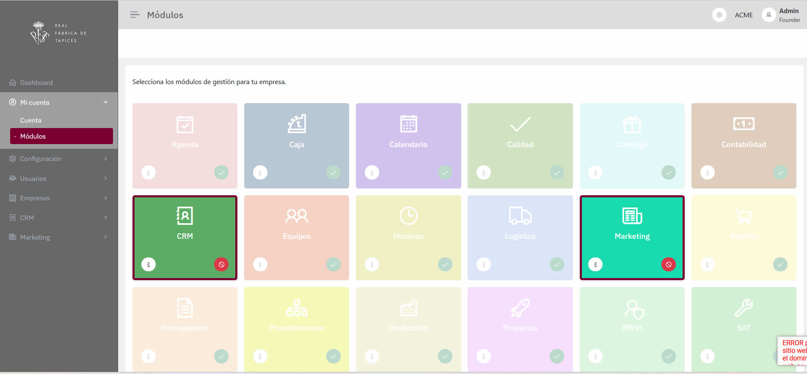

# Spec: App Layout & Navigation

## Context

El ERP utiliza un layout estructural común para todos los módulos, compuesto por:

- Un **aside izquierdo** con el menú de módulos y funcionalidades.
- Una **barra superior** con información contextual y acciones globales.
- Una **zona de contenido principal** donde se renderiza cada funcionalidad.

La visibilidad de módulos, funcionalidades y opciones de menú está condicionada por:

- los módulos activados para la empresa en sesión,
- los permisos asignados al usuario (Spatie Laravel Permission),
- y la empresa seleccionada cuando el usuario pertenece a más de una.

---

## Requirements

### Requirement: Estructura del aside de navegación

**Archivo:** `/resources/js/Pages/Admin/Partials/Sidebar.jsx`

El aside izquierdo DEBE mostrar el menú de navegación en este orden, de arriba hacia abajo:

1. Logo del proyecto.
2. (Opcional) Logo de la empresa en sesión.
3. Menú de **módulos obligatorios**.
4. Menú de **módulos administrativos**.
5. Menú de **módulos optativos** (dinámicos).

Los módulos optativos se cargan desde backend mediante `GET /secondary-menu`. El backend ya filtra y solo envía módulos activos para la empresa en sesión.

#### Comportamiento general de carga y renderizado

- El backend (SecondaryMenuController@__invoke) DEBE devolver módulos y funcionalidades ya filtrados según empresa en sesión y permisos del usuario.
- El frontend NO DEBE filtrar por `id`.
- El frontend NO DEBE aplicar reglas adicionales salvo validación mínima (si la respuesta no es un array, se trata como `[]`).
- Al cambiar de empresa en sesión, el frontend DEBE reconsultar `GET /secondary-menu` y re-renderizar el menú dinámico.

Reglas: 
- Si GET /secondary-menu falla, el frontend DEBE dejar modules = [] (no romper sidebar), y no mostrar ningún módulo.
- Si no hay empresa en sesión, todo el menú queda vacío.

#### Tipos de módulos y reglas de visibilidad

**Módulos administrativos**
- Son exclusivos del rol **Super Admin**.
- Solo DEBEN mostrarse si el usuario tiene el rol **Super Admin**.
- Ninguna ruta asociada a módulos administrativos DEBE ser accesible para un rol distinto de **Super Admin** (ver requirement de middleware).

**Módulos obligatorios**
- Son los módulos: **Dashboard**, **Mi Cuenta**, **Usuarios** y **Empresas**.
- Estos módulos DEBEN mostrarse solo si el usuario tiene permisos sobre el módulo o sobre alguna de sus funcionalidades.
- Si el usuario carece por completo de funcionalidades visibles dentro de un módulo obligatorio, dicho módulo DEBE ocultarse.
- Dentro del módulo, una funcionalidad SOLO DEBE mostrarse si el usuario tiene permiso para ella (ver reglas de funcionalidades).

**Módulos optativos**
- Son seleccionados/activados por cada empresa (plan o configuración).
- El backend DEBE filtrar y devolver únicamente los módulos activos para la empresa en sesión.
- Para el usuario SOLO DEBEN mostrarse aquellos módulos activos para los que tenga permisos específicos.
  - Permiso de módulo con estructura: `module_[slug-module]`
- El usuario SOLO DEBE ver (y poder acceder a) las funcionalidades del módulo para las que tenga permiso.
  - Permiso de funcionalidad con estructura: `[functionality-slug].*`
- La relación de módulos activos de la empresa tiene prioridad sobre cualquier permiso del usuario:
  - Si la empresa no tiene activo un módulo, NO DEBE mostrarse aunque el usuario tenga `module_[slug]`.
- Un módulo optativo DEBE ocultarse si, tras filtrar, queda sin funcionalidades visibles.

#### Reglas de visibilidad de funcionalidades

Regla base:

- Un usuario NO DEBE ver en el submenú una funcionalidad para la que no tenga ningún permiso asociado del tipo `[functionality-slug].*`, salvo que se defina explícitamente lo contrario en reglas de negocio específicas.

- El rol Super Admin ve todas las funcionalidades de todos los módulos sin excepción, aunque no tenga permisos granulares. Tiene total y pleno acceso a todos los módulos y todas las funcionalidades.

> Nota: si en la implementación actual se muestran todas las funcionalidades del módulo y la autorización se delega únicamente a middleware de rutas, este requirement deberá ajustarse o será base de un futuro cambio OpenSpec.

#### Scenarios

**Scenario: Empresa con módulo no contratado**
- El módulo “Marketing” existe en el ERP como módulo optativo.
- La empresa E1 no tiene “Marketing” incluido en su tipo de cuenta.
- El usuario tiene un rol que incluiría permisos para el módulo “Marketing”.
- El aside NO muestra el módulo “Marketing” para E1.

**Scenario: Usuario sin permiso de módulo**
- La empresa E2 tiene el módulo “Contabilidad” activado.
- El usuario NO tiene el permiso `module_contabilidad`.
- El aside NO muestra el módulo “Contabilidad” para ese usuario, aunque esté activo para E2.

**Scenario: Funcionalidad sin permisos asignados al usuario**
- El módulo “Pedidos” está visible.
- La funcionalidad “Pedidos de compra” genera permisos como `purchases.index`, etc.
- El usuario no tiene el permiso de `purchases.index`.
- El submenú de “Pedidos” no muestra la opción “Pedidos de compra”.

---

### Requirement: Contratos de datos del menú dinámico

#### Entity: Module (dynamic)

Representa un módulo del menú dinámico.

Campos mínimos esperados:

- `id` (int|string)
- `name` (string)
- `slug` (string) (ej: `"account"`, `"users"`, `"companies"`, `"orders"`)
- `label` (string) (ej: `"contabilidad"`, `"usuarios"`, `"empresas"`, `"pedidos"`)
- `icon` (string) (ej: `"user-circle"`, `"users"`, `"building"`, `"shopping-cart"`)
- `functionalities` (array)

#### Entity: Functionality

Elemento de submenú dentro de un módulo.

Campos mínimos esperados:

- `id` (int|string)
- `name` (string)
- `slug` (string) (ej: `"accounting-accounts"`, `"bank-accounts"`, `"company-calendar"`)
- `label` (string) (ej: `"cuentas_contables"`, `"bancos_cuentas"`, `"calendario_empresa"`)

Regla: el frontend NO DEBE derivar nada.

Contratos de enrutado y permisos:

- La ruta se genera a partir del slug de la funcionalidad + `.*` (ej: `"users.index"`, `"users.contacts"`, `"companies.index"`).
- El permiso requerido tiene el mismo nombre que la ruta (ej: `"users.index"`, `"companies.index"`).
- El slug de Functionality DEBE ser route-name-safe y coincidir con el nombre base de ruta.
- El backend DEBE enviar route_name y permission_name explícitos y el frontend NO DEBE derivarlos.
---

### Requirement: Estructura de la barra superior

La barra superior DEBE mostrar, de izquierda a derecha:

1. Nombre de la **funcionalidad activa** y, cuando aplique, la acción actual (por ejemplo: “Pedidos > Listado”, “Pedidos > Nuevo”).
2. Selector de idioma.
3. Widget para establecer preferencias de menú (por ejemplo, módulos “favoritos”).
4. Espacio reservado para futuras opciones globales (chat, notificaciones, notas personales, etc.). *(TODO: especificar cuando se implementen)*.
5. Nombre de la empresa en sesión o selector de empresas cuando el usuario está vinculado a más de una.
6. Menú del usuario logueado (acceso a perfil personal, logout y otras opciones de cuenta de usuario).

#### Scenario: Usuario con varias empresas

- El usuario está vinculado a las empresas E1 y E2.
- La empresa en sesión es E1.
- La barra superior muestra el nombre de E1 junto a un selector de empresa.
- Al cambiar a E2 mediante el selector, se actualizará el contexto de sesión y la navegación (ver requirement correspondiente).

---

### Requirement: Actualización de navegación al cambiar de empresa

Cuando el usuario cambie de empresa en el selector de la barra superior, el sistema DEBE:

- actualizar la empresa en sesión,
- recalcular los módulos visibles según los módulos activados para la nueva empresa,
- recalcular las funcionalidades visibles en cada módulo en función de los permisos del usuario en esa empresa.

#### Scenario: Cambio de empresa con diferente set de módulos

- El usuario pertenece a E1 y E2.
- En E1 están activos los módulos A, B, C.
- En E2 están activos solo los módulos A y D.
- El usuario cambia desde E1 a E2 usando el selector.
- El aside se actualiza para mostrar únicamente A (si tiene permiso) y D (si tiene permiso), ocultando B y C.

---

### Requirement: Middleware y protección de rutas

La navegación DEBE estar alineada con la protección de rutas:

- La visibilidad de módulos y funcionalidades en el menú no es suficiente por sí sola para la seguridad.
- Todas las rutas de módulos y funcionalidades DEBEN estar protegidas por middleware/policies que validen:
  - la empresa en sesión,
  - los permisos de módulo y funcionalidad correspondientes.

#### Scenario: Acceso directo a URL sin permiso

- Un usuario sin permiso `module_rrhh` ni permisos de funcionalidades de RRHH intenta acceder directamente a una URL de RRHH mediante una URL escrita a mano.
- El middleware/policy de autorización rechaza el acceso (por ejemplo, 403), independientemente de que la opción no aparezca en el menú.

---

## Notes

- Este spec describe el comportamiento esperado del layout y navegación global, así como su relación con módulos, funcionalidades, permisos y empresa en sesión.
- Los cambios futuros en el layout visual deberán respetar estos requisitos de estructura y visibilidad, o bien actualizar esta spec de forma explícita.

---

## Visual References

